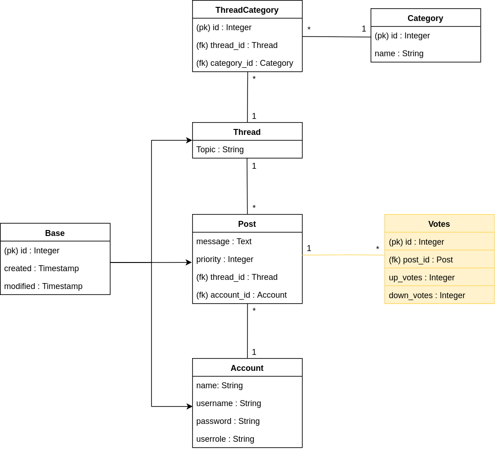

# Tietokantasovellus 2019 - Keskustelufoorumi

## Linkit
* [Heroku:](https://tsoha-keskustelufoorumi-jj.herokuapp.com/) 
  * Käyttäjätunnus: aku, hessu
  * Salasana molemmat: ankkalinna (Helppo rekisteröidä myös oma käyttäjä)
  
* Sovelluksen tila, [weeklyUpdate:](https://github.com/Zessi19/Tietokantasovellus-2019/blob/master/documentation/WeeklyUpdate.md)

* Asennusopas: [InstallationGuide.md](https://github.com/Zessi19/Tietokantasovellus-2019/blob/master/documentation/InstallationGuide.md)
* Käyttöopas: [UserGuide.md](https://github.com/Zessi19/Tietokantasovellus-2019/blob/master/documentation/UserGuide.md)

## Sovelluksen kuvaus

Harjoitustyössä tavoitteena on kehittää "old-school" -tyyppinen keskustelufoorumi. Käyttäjä kirjautuu tunnuksellaan foorumille, jolloin käyttäjälle avautuu näkymä kaikista viestiketjuista otsikkoineen (threads). Käyttäjä voi tämän jälkeen valita haluamansa viestiketjun tai luoda kokonaan uuden viestiketjun. Jos käyttäjä valitsee jonkun viestiketjuista, hänelle avautuu näkymä viestiketjun otsikosta ja kaikista viestiketjun viesteistä (posts). Käyttäjä voi myös samassa näkymässä osallistua keskusteluun kirjoittamalla viestiketjuun uuden postauksen.

Kun käyttäjä luo uuden viestiketjun, hänen pitää valita mihin ennalta määriteltyyn kategoriaan viesti kuuluu, näitä kategorioita (tags) tulee olla yksi tai useampi. Jos foorumimme käsittelesi esimerkiksi Nintendo pelejä, tageja voisi olla esimerkiksi NES, SNES, N64, GC, Wii, WiiU, Switch, GB, GBA, DS, 3DS, jrpg, rpg, platformer, puzzle, simulator, shooter, racing, sports, nintendoDeals ja general. Kirjautuessaan sisään käyttäjällä on mahdollisuus valita kaikkien viestiketjujen näkymässä näytettävän vain ne viestiketjut, jotka sisältävät yhden tai useamman käyttäjän valitseman tagin, esimerkiksi n64 ja platformer.

Keskustelufoorumilla on kaksi eri kättäjätyyppiä: user ja admin. Normaalikäyttäjään user nähden adminilla on mahdollisuus poistaa mikätahansa viesti tai viestiketju ja poistaa kenentahansa normaalikäyttäjän käyttäjätunnus. Mahdollisesti adminille voidaan myös lisätä myös mahdollisuuksia muuttaa viestiketjun tageja, jos ne on asetettu väärin (vastaa perinteisillä foorumeilla viestiketjun siirtämistä oikeaan aihealueeseen).

Ajan salliessa projektia voidaan laajentaa antamalla käyttäjän mahdollisuus "up votea tai down votea" yksittäisiä viestejä. Tällöin käyttäjän avatessa viestiketjun, viestit voidaan järjestetää "up votejen" mukaan ja näin saadaan sovellukseen lisää "monimutkaisia yhteenvetokyselyitä". Monimutkaisempaa toiminnallisuutta voidaan lisätä myös antamalla käyttäjälle mahdollisuus järjestää yleisnäkymässä viestiketjut tagien lisäksi esimerkiksi päivämäärän, aktiivisuuden (viestien lkm) tai viestiketjun upvotejen kokonaismäärän mukaan. Huom! Tämän kappaleen toiminnallisuudet eivät kuulu projektin ydintoimintoihin ja niitä aletaan toteutetaa vasta kun ylläolevat perustoiminnallisuudet ovat kunnossa. 

## Sovelluksen keskeisiä toimintoja

* Kirjautuminen
* Viestiketjujen näyttäminen eri kriteerein
* Viestiketjun valitseminen ja kaikkien viestien näyttäminen (eri kriteerein)
* Käyttäjä: viestiketjuun kirjoittaminen
* Käyttäjä: viestiketjun luominen
* Käyttäjä: oman viestin poistaminen
* Admin: viestin poistaminen
* Admin: viestiketjun poistaminen

## Tietokanta kaavio

Tietokantakaaviossa ydintoiminnallisuudet käsittelevät tietotaulut on valkoisia, ajan salliessa lisättävä äänestytoiminnallisuuden Votes-tietotaulu on keltainen ja hifistely mielessä tehty käyttäjän avatarin tallettava User-tietotaulun atribuutti picture on maalattu punaiseksi. Tietotaulujen atribuutit seuraavat Tietokantojen perusteet -kurssin notaatiota. Character atribuutit on nimetty toistaiseksi yleisnimityksellä "String", mutta projektin edetessä ne päivitetään esimerkiksi halutun pituisiksi VARCHAR(X) atribuuteiksi.  

## Poisrajatut toiminnallisuudet ( Vertaa moderni keskustelufoorumi)

* Käyttäjän varmentaminen sähköpostilla yms.
* Yksityisviestit käyttäjien välillä
* Ryhmäviestit käyttäjien välillä
* Muiden käyttäjien viestin lainaus tai vastaus tiettyyn viestiin josta muodostuu oman alahaaran.
* Ei mahdollista asettaa väliaikaista käyttökieltoa käyttäjälle, vain permanent ban (käyttäjän poisto)
* Ulkoasu pelkistetty vs Moderni keskustelufoorumi

## Kysymyksiä

(Week 2 Update: Tämä käsitellään ilmeisesti materiaalissa myöhemmin)

Onko adminin oikeuksien merkitseminen User-tietotauluun omana Boolean muuttujana järkevä tapa? Ohjelmaan on tarkoituksena kovakoodata oma käyttäjätunnukseni, jota ei ole mahdollista poistaa käyttäjänpoisto -metodilla. Uuden käyttäjän tapauksessa Boolean muuttuja asetetaan aina off-tilaan. Tämän jälkeen toisella admin-käyttäjällä on toiminnallisuus, jolla valittu user-käyttäjä voidaan siirtää user-tilasta admin-tilaan, ja ohjelman metodi asettaa tällöin Boolean muuttujan on-tilaan. 
